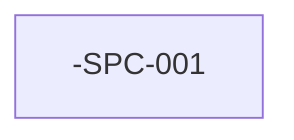

# <Product name> — Spec portfolio

| Field | Value |
|-------|--------|
| Product key | `<KEY>` |
| Portfolio status | `draft` |
| Revision | 1 |
| Updated | YYYY-MM-DD |
| Sources | — |

## Intent

<One paragraph: what product increment this register supports and what "done" means at portfolio level.>

## 1. Decomposition rules

- One SDD spec row = one releasable user-visible outcome.
- <Add project-specific rules, e.g. tenant boundaries, mobile-first R0, etc.>

## 2. Spec register

| Id | Slug | Title | Outcome (1 line) | Source refs | In scope | Out of scope | Depends on | Priority | Ready for specify? | Status |
|----|------|-------|------------------|-------------|----------|--------------|------------|----------|--------------------|--------|
| `<KEY>-SPC-001` | `<slug>` | | | | | | — | R0 | no | proposed |

## 3. Sequencing

**Suggested specify order:** `<KEY>-SPC-001`, …

## 4. Open product questions

| Id | Question | Blocks rows | Answer | Status |
|----|----------|-------------|--------|--------|
| `<KEY>-Q-001` | | | | open |

## 5. Release cut

| Release | Spec ids | Notes |
|---------|----------|-------|
| R0 | | |

## 6. Approval

**Portfolio status:** draft  
**Approved for SDD:** no

## 7. Handoff to Spec Kit

_(Complete after approval.)_

- **Next row:** —
- **Suggested specify prompt:** —
